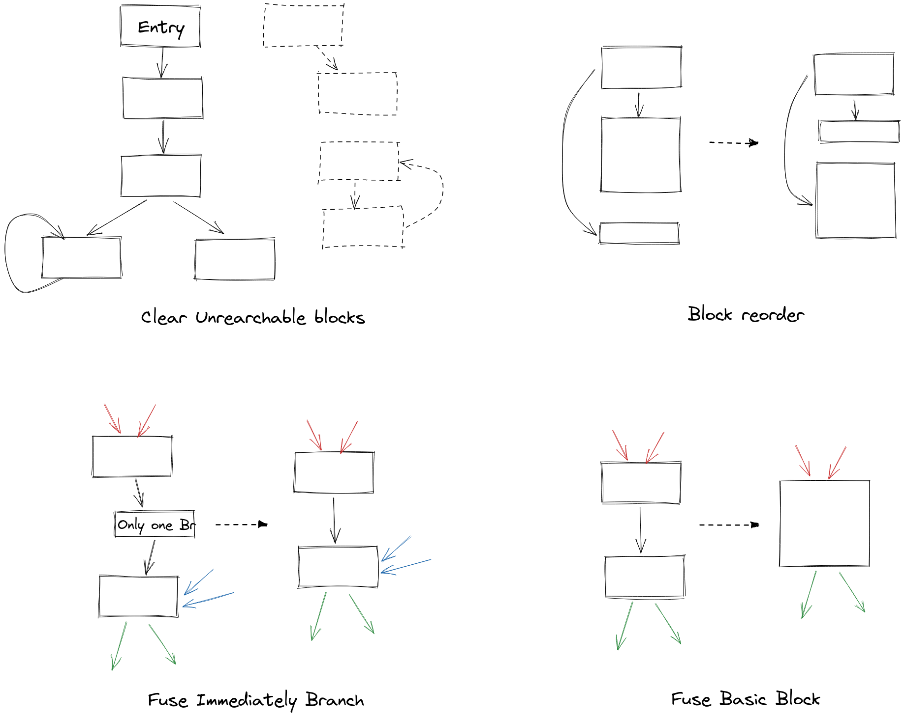

# IR 优化 pass 介绍

## 总览

- 指令
  - ClearUselessInstruction: 无用指令清除
  - ConstantFold: 常数折叠
  - RemoveTrivailPhi: 无用 Phi 消除
  - InstructionCombiner: 指令组合
  - SimpleGVN: 简单的全局表达式合并
  - GCM: Global Code Motion, 全局代码移动
  - LCM: Local Code Motion, 局部代码移动

- 块与跳转:
  - ClearUnreachableBlock: 死块消除
  - FuseBasicBlock: 将可以缝合的块缝合在一起
  - FuseImmediatelyBranch: 将跳转之后又接着跳转的二次跳转消除
  - BlockReorder: 块重排 (调整基本块的顺序)

- 函数:
  - ClearUselessFunction: 无用函数清除
  - FunctionInline: (非递归) 函数内联

- 内存/数组/全局变量:
  - GlobalVariableToValue: 将全局变量转化为局部变量
  - RemoveUnecessaryArray: 无用数组删除 (只 store 不 load 的数组)
  - ReplaceConstantArray: 常量数组删除 (只 store 一趟 / 不 store 只 load 的数组)
  - LocalArrayHoist: 将在支配深度较深的循环定义/初始化/store 上移到较浅的地方
  - ReplaceUnececssaryLoad: 合并不必要的 Load

- 循环:
  - InductionVariableReduce: 归纳变量强度削减
  - FullyUnroll: 迭代次数确定的循环的完全展开
  - LoopUnroll: 普通循环展开
  - SimpleInvariantHoist: 朴素循环不变量外提

- 分析:
  - CollectLoops: 收集循环信息 (循环深度由此获得)
  - CollectAndTransformCanonicalLoop: 将循环尽可能地转换为正则循环, 同时收集信息
  - ForLoop.tryConvertFrom (位于 LoopUnroll 中): 判断并转换循环为 ForLoop, 同时收集信息
  - CollectMemoryDefinition: 收集内存信息 (非常粗劣的实现)
  - ConstructDominatorInfo: 收集支配信息 (支配集合, 直接支配, 支配树由此获得)

- 实现相关优化:
  - HoistGlobalArrayLoad: 将全局变量/数组的第一次 Load 统一提升到函数开头
  - RemoveCurrDef: 删除前端生成时挂在基本块中的一些无用数据结构

对于简单的优化实现, 下文将不再多费笔墨, 烦请读者自行参阅相关实现.

## 指令

### 常数折叠

由于历史原因, 常数折叠主体实现代码分散在 `frontend/folder/*` 与 `frontend/IRBuilder` 中. 其中 IRBuilder 中的代码多为包装/分发作用, 而 folder 中的具体几个实现即为常数折叠的实现. 实现主体采用常见的递归架构, 但由于整数常数折叠使用次数过多导致拖慢编译器性能, 其增加了一个缓存以供提速.

### 指令组合

该 pass 主要是固定一些 IR 的模式, 方便其它 pass 使用, 同时也为优化提供可能. 其总体架构类似于一个图上的模式匹配, 因此也许也可以称为是 "IR 上的窥孔".

我们主要实现了下面的功能:

- swapConst: 将二元整数加法/乘法的常量参数尽可能放在右边
- biOpWithZeroOneComb: 加零, 乘零, 乘一, 减零, 除以一
- distributeIMulComb: 分配律提取公因子
- addMulConstComb: 将 `(i + a)*b` 的形式转换为 `i*a + a*b` 的形式, 其中 a, b 都是常数
  - 此优化是为了将可能的表达式转换为 `i*a + b` 的线性形式, 供归纳变量消除使用.
- tryFlattenNestedAdd: 将连加的式子转换为乘法形式
- tryFlattenNestedMul: 将连乘的式子转换为快速幂形式

### 全局表达式合并

理论上讲 SSA 的 IR 能做的冗余消除有很多, 比如非常出名的 "Sparse conditional constant propagation", 甚至可以在控制流带循环的情况下都分析出定值出来. 但是出于个人水平原因, 我们只做了一个比较简单的 GVN.

一般来讲, 在搜这种优化的资料的时候, 你会发现各种各样的名字:

- CSE: Common Subexpression Elimination
  - 公共子表达式消除, 一般是属于且关注词法/位置部分的, 倾向于局部的(块内的), 对词法上相同的变量构成的子表达式的消除
- GCSE: Global CSE
  - 全局公共子表达式消除, 除了有上面的特点之外, 还会对控制流进行分析, 获得跨块的当前执行路径上的所有可用的子表达式
- GVN: Global Value Numing
  - 全局值编号, 更多地关注可用的 "值" 而非可用的 "变量"/"词法表达式", 尤其适合本项目的 IR 这种基于值的 SSA IR. 由于在 LLVM 里被使用而知名
- PRE: Partial Redundancy Elimination
  - 部分冗余消除: 有些时候有的值只有在控制流从特定的块流过来的时候才有, 这时候想在该块里消除这种冗余就只能往其它前继块里塞一个计算这个值的指令, 使这个值变为 "完全冗余的", 然后再插入 phi 或是直接将其提升来消除这个冗余
- GCM: Global Code Motion
  - 全局代码移动: 这个优化并不会删除冗余的值, 但是它会将各个指令调度到支配深度尽可能浅的地方, 从而提升这个值支配的块的数量, 为寻找冗余创建机会, 所以经常与各种冗余消除搭配, LLVM 里有一个 "GVNGCM" 的 pass, 就是它跟 GVN 搭配着用的

不同的做法有不同的难点不同的要求, 难点在哪也取决于 IR 设计. 比如说对于直接使用普通三地址代码 IR 的编译器来说可能在 AST 翻译的时候顺手做掉 CSE 比较合理, 而对本项目这种使用图状 IR 的来说 GVN 更加好做.

我们的 GVN 实现得比较简单, 具体来说便是直接使用一个数据流分析, 对每个基本块维护一个可用值的集合, 从开头到结尾的指令都加入到这个集合中, 如果遇到已经在集合中的指令就将所有对它的使用替换为对集合中的指令的使用. 然后可用值的集合从前继继承, 如果一个值在所有前继中都有, 那么就继续保留, 否则删去 (取交集). 然后 ~~大火收汁即可~~ 数据流分析跑到 fix point 为止即可.

> 其实好像可以直接在支配树上先序迭代做的? 不一定就要数据流分析

这里可能要多想想的就是怎么样的指令算 "相同的" 指令. 本项目对 "相同指令" 的定义是: 类别相同, 参数同一的指令算 "相同".　(详见 Instruction 的 hashCode 与 equals)

> 实际上这种设计在不少地方都显得有点麻烦, 特别是有些需要以指令作为键存 Map 的情况, 如果这样一定义出 hashCode 跟 equals 很可能会无意识地把某些不同一但 "相等" 的指令顶掉.
>
> 并且, 这个设计会导致指令的 hashCode 与指令的参数有关; 一旦你修改了指令的参数 (比如对参数调用了 RAUW, 或者对指令调用了 replaceOperand), 那么会导致当你把这个指令传给之前的 map 的时候, 它找不到之前的值了 (因为 hashCode 变了). 这个我们队已经被坑了三次了
>
> 所以, 最好还是直接把 Instruction 的 hashCode 跟 equals 定义为同一 (System.identifiyHashCode), 然后在 GVN pass 里单独定义一个按照指令类别和参数算 "hash" 的函数比较好

另外还有一些参考资料:

- 介绍 CSE 的 (非 SSA): [CMU 15745-f03 L6](http://www.cs.cmu.edu/afs/cs/academic/class/15745-f03/public/lectures/L6_handouts.pdf)
- 介绍 SSA 下的冗余消除的: [CMU 15745-f03 L12](http://www.cs.cmu.edu/afs/cs/academic/class/15745-f03/public/lectures/L12_handouts.pdf)
- 介绍 GCM/PRE/GVN 的: [Cliff Click - GCM GVN](https://courses.cs.washington.edu/courses/cse501/06wi/reading/click-pldi95.pdf)

### 全局代码移动

正如上面所说, 这个优化能最大化冗余消除的力量, 而它实现起来也, 嗯..., 不考虑坑的话, 挺简单的.

这个优化的两个中心操作是 "往下丢" 跟 "往上丢". 我们知道一条指令, 它必须支配它的所有使用, 也必须被它的所有使用者支配, 而这个范围之内就是这条指令可能的出现位置. 所以我们可以写出下面的简单函数来快速地给这条指令找到一个合适的位置:

```
往下丢(指令):
    把指令的所有使用者尽可能地往下丢
    将指令尽可能地往下丢 (直接将指令放到它的所有使用者所在块的支配树上的最近公共祖先块中)

往上丢(指令):
    把指令的所有参数尽可能地往上丢
    在保证指令执行次数少的情况下尽可能地缩短它的生存期:
        找到支配深度最深的参数所在的块, 获得这个块嵌在几层循环里 (记为 min-loop-depth)
        从指令的最低的块出发, 顺着 idom 往上走, 直到找到最早的一个循环深度与 min-loop-depth 相同的块为止

GCM:
    将所有指令往下丢;
    将所有指令往上丢;
```

显然 GCM 的思想便是 "在指令执行次数最小的情况下让指令的生存期最短". 在论文里, 往下丢跟往上丢又叫 schedule late 跟 schedule early.

当然, 在实际写代码的时候, 还有亿点点细节要处理:

1. 有些指令的位置是不能动的, 比如说跳转, Load/Store, Phi, 跟有副作用的 Call.
2. 当你把指令丢到新的块的时候, 怎么样确定它应该插在这个块的哪里呢? 毕竟:
  - 新块里可能有这个指令的参数
  - 新块里可能有这个指令的使用者
3. 当你在向下丢的时候把指令挪到了不同的块, 然后向上丢又丢回原来的块的情况下, 这算不算你修改了 IR?
  - 因为我们的跑 pass 的策略是 "跑到这个 pass 不修改 IR 为止", 所以这种改了又改回来的会直接导致死循环

对于这些问题, 我们的解决方法是:

1. 很简单, 直接加个判断即可
2. 在插入指令时检查一下:
    - 如果块里有自己的参数, 那就插入到这个块的末尾
    - 如果块里有自己的使用者, 那就插入到块的开头
    - 不可能两个都有, 否则这个指令根本逃不出这个块
3. 不直接在往下丢的时候修改 IR, 而是先存起来, 等到往上丢也结束之后, 再根据结果重新插指令. 并且对于那些位置不变的指令不去动它

### 局部代码移动

由我们上面的全局代码移动的解决方案 2 可以猜出, 当我们在移动某些指令和与之关联的指令的时候, 很有可能就把这些相互关联的指令 "拆散" 了 -- 比如翻译源语言里的 `a + b*c`, 有可能 `b*c` 的指令被丢到了块的开头, 而 `a + (b*c)` 的指令被丢到了块的末尾. 这样就会导致后端在翻译的时候不得不将 `b*c` 这个值的生存期拉得特别长, 非常的不好. 所以我们需要一个块内的重排来确保这种离谱的事情不会发生.

严格来讲, 局部代码移动要怎么移才算好是一个非常困难的问题. 要考虑的部分很多:

1. 有些带副作用的指令是确定的, 指令移动的时候不能 "越过" 这些指令. 譬如 Load/Store/Call
2. 关于 "好" 的定义本身就比较模糊: 是所有值的总生命周期最小好呢, 还是最长生命周期最短好呢, 还是同一时刻生命周期重叠数最大值最小好呢?
3. 有时候一些在局部上看起来好的结果, 放到全局不一定是最好的 -- 比如一个值它不使用任何块内的其它指令也不被块内其它指令使用, 那它理论上应该放哪都可以; 但如果它往后有块外使用, 或者它使用了前面的块外指令, 那么它就更应该倾向于被放在块的末尾/开头, 而不是随便乱放或者反之

这些问题越是思考就越是感觉很难搞. 出于时间关系, 我们最后只实现了下面这个最简单的情况, 可以说只是做了点微不足道的启发式优化:

- 如果一个指令有且只有一个使用者, 并且这个使用者在块内, 那么将这个指令移动到使用者的正前面

<!--
下面是我们进行过的一些讨论与想法, 并没有真正实现, 仅供参考.

#### 关于局部代码移动的思考

我们可以把一个基本块再细分为多个 "块" (chunk), 每个块由前面的可自由移动的指令与最后一条不可移动的指令组成. 块中的自由指令按依赖图的拓扑深度可以分成不同的层 (layer), 每层之间的指令互不依赖, 可以自由互相交换顺序.
-->

## 块与跳转

四个优化一张图解释:



### 死块消除

非常简单: 从入口块开始递归, 顺着后继访问完整颗树, 然后删除没有访问过的块即可.

不可以偷懒直接检测没有前继的块删掉, 一是入口块也没有前继, 二是有时候有些不可达的块会成环, 但是那个环是独立于从入口块进来的那堆块的.

### 块重排

这个重排并不是什么论文里的很高大上的什么 "用深度学习根据程序执行时的信息分析来优化程序" 之类的东西, 只是一个基于简单规则的对基本块生成顺序的优化罢了. 规则如下:

1. 符合支配顺序: 设 A, B 为基本块, 若 A 支配 B, 则 A 的顺序在 B 之前 (反之则不成立)
2. 直接跳转优先: 设 A, B, C 为基本块且 A 支配 B, C. 若 A 直接跳转到 B 且不直接跳转到 C, 则 B 的顺序在 C 之前
3. 循环优先: 设 A, B, C 为基本块且 A 支配并直接跳转到 B, C. 若 B 在 CFG 中的后继闭包中存在节点 D, D 有到 A 的 CFG 中的返祖边, 并且 C 不符合此条件, 则 B 的顺序在 C 之前
4. 小块优先: 设 A, B, C 为基本块且 A 支配并直接跳转到 B, C. 若 B 的指令数小于等于 4 且 C 不符合此条件, 则 B 的顺序在 C 之前

上述四条规则优先级自上而下. 规则中没有提到的情况则顺序随机. 规则一二三是显然的, 规则四是为了方便后端将小块转成条件执行.

### 直接跳转融合

如果一个块的终止指令是直接跳转, 并且直接跳转到的基本块里有且只有一条直接跳转的指令, 那么就把这个二次跳转消除. 这个要求中间那个只有一条跳转指令的基本块的前继只有一个, 要不然就不能删了.

### 块融合

在直接跳转到另一个块, 并且跳转目标块没有其它前继的情况下, 可以直接把两个块合成为一个大块. 据搞后端的队友说 ARM 里跳转对 CPU 流水线摧残巨大, 一次跳转 CPU 需要缓三个周期才能再充满流水线. 所以跳转的数量非常重要.

## 函数

### 非递归函数内联

函数内联的实现比较简单, 将函数内的指令复制一遍, 然后将复制出来的指令里所有对形参的使用换成对实参的使用, 返回指令换成一个到新建的返回块的跳转, 返回值 (如果有的话) 换成填充到那个新返回块的 phi 指令的对应位置的值. 在调用处将包含 call 指令的基本块一分为二, call 前面跟 call 后面单独成块, 然后将被内联的函数复制出来的块以及返回块插入对应位置, 所有对 call 的使用都换成对承载返回值的 phi 的使用即可.

```
函数内联:
    before_call, call, after_call = 将 call 指令所在块分开前后
    exit_block = new BasicBlock

    如果被调用的函数有返回值:
        phi_for_return = new EmptyPhi

    callee_cloned = 复制被调用函数(exit_block, phi_for_return)

    删除原来的基本块
    依次插入 before_call, callee_cloned, exit_block, after_call 并维护好前继和跳转
    将对原来的 call 指令的所有使用替换为对 phi_for_return 的使用


复制被调用函数(exit_block, phi_for_return):
    维护一个旧指令到新指令的映射
    每次复制指令的时候, 就先将旧指令的所有参数换成新的复制体里对应的指令, 然后在构建一个相同的, 但全部使用对应的新参数的指令
    对于 return 指令, 改为插入一条到 exit_block 的 br 指令, 并且在函数有返回值的情况下将返回值插入到 phi_for_return 的参数中
```

另一个难点是确定什么时候可以内联一条 Call 指令. 按照直觉来看, 递归的函数是不能内联的, 而递归除了直接递归之外还有你调用我, 我调用你这种间接递归. 理论上讲, 为了完全确认内联的可行性, 必须在调用图上跑一遍 Tarjan 缩点, 然后所有多个节点组成的强联通分量内部和对该强联通分量的直接调用都是不可以内联的. (但如果说 A -> B -> C -> D, D -> C 这种情况, A -> B 是可以内联的).

但是我寻思了一下感觉这样太麻烦了, 于是就使用了一个偷懒的做法:

1. 首先定义什么叫 "简单的函数":
   1. 不是外部函数 (有函数体)
   2. 没有对非外部函数的 call 指令
2. 每次遍历所有函数的所有指令, 内联所有对简单函数的调用
3. 一直遍历, 直到某次遍历没有修改为止

这样的做法事实上就相当于一次拓扑排序: 每次都删除无外度节点 (没有调用其它函数的函数), 直到不能删除为止, 留下的自然就是一个大节点跟可能的几个环. 但是这种方法的缺点在于对于上面提到的 A -> B -> C -> D, D -> C 这种情况, 没办法内联 A -> B. 但是感觉上如果一个函数开始递归调用函数了, 那前面的非递归部分多几遍好像也没有什么问题...?

## 内存

长话短说, 我本人 (Origami404) 对我自己的在这个编译器里设计的内存分析的实现方法极端不满意, 我不知道我当初是发了什么疯搞出的这个玩意 (可能是因为那时候第一次遇到不得不求支配信息的东西, 被构造支配信息这个需求整懵了头脑). 因此这节里的介绍希望读者取其精华, 明白优化的目的就好, 千万不要照抄. 如果能再来一次, 我必然会选择 [Memory SSA](https://llvm.org/docs/MemorySSA.html) 这种正经玩意, 而不是自己乱搞.

顺带一提 ayame 就实现了 Memory SSA.

### 收集内存信息 (本项目版)

在本项目的内存分析里, 我的打算是 "收集所有的静态的内存位置里的值", 为此我设计了下面的体系:

- 每一个源语言里的全局变量, 全局数组, 局部数组, 数组形参定义了一块独立的内存空间
- 每一块内存空间里都有一个或多个特定内存位置, 通过完整的索引呈现

## 支配信息

原本以为支配信息很难搞的, 毕竟 Tarjan 那个算支配树的算法看起来实在是太哈人了... 直到我看见 [维基百科](https://en.wikipedia.org/wiki/Dominator_(graph_theory)#Algorithms) 为止.

计算支配集合的方法其实超简单, 而只要支配集合一出来, 其它所有支配信息就立马都有了. 维基百科上给的求解支配集合的算法是一个类似数据流分析的 "逐步细化" 的算法. 它首先给所有基本块的支配集赋上初始值 (有可能支配这个块的块的集合), 随后慢慢地根据前继的支配集信息来细化自己的支配集信息 (排除不可能支配自己的块). 由于这种细化必然只会让支配集变小, 所以跑足够久就必然能跑到 fix point 去.

```python
// 先给各个块赋上尽可能多的能支配它的块
// 有可能支配起始块的只有起始块
Dom(n0) = {n0}
// 非起始块有可能被所有其它所有块支配
for n in N - {n0}
   Dom(n) = N;


// 随后开始细化
while changes in any Dom(n):
   for n in N - {n0}:
       Dom(n) = {n} union with intersection over Dom(p) for all p in pred(n)
```

## 循环

### CollectLoops

什么是循环? 带反向边的就是循环. 循环的样子可以很奇怪, 为了让我们的后续处理方便, 我们经常会把各种奇怪的循环的样子修一修, 让它变成样子正常的循环. 这种样子正常的循环称为正规循环 (Canonical Loop).


